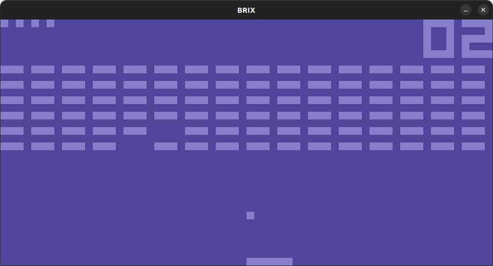
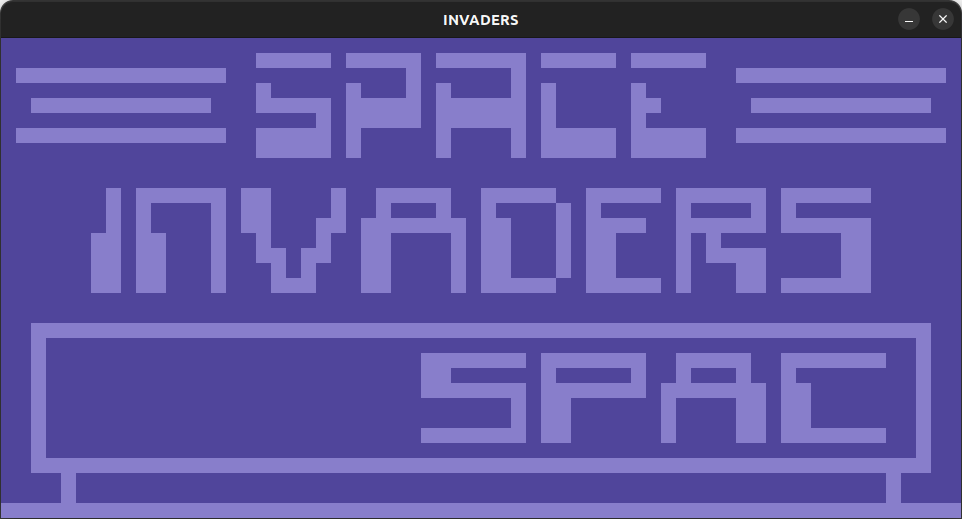
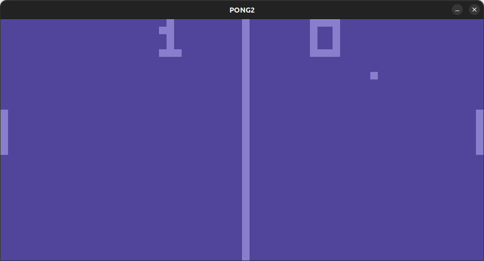
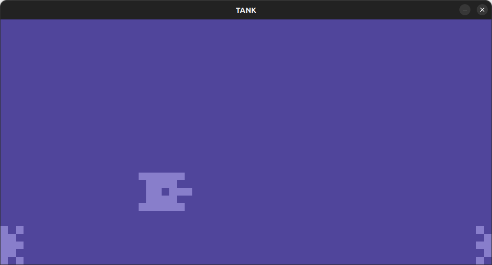
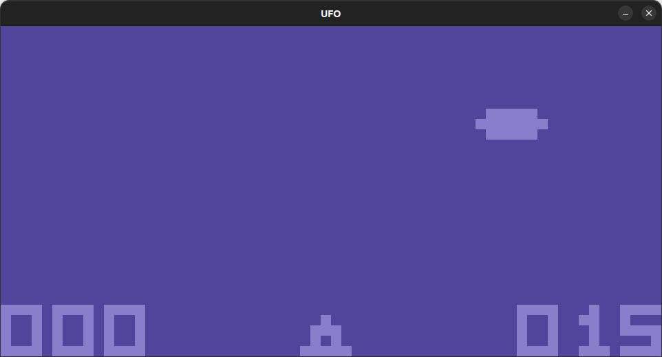

# CHIP-8 emulator
Simple python emulator/interpreter for the CHIP-8 language. 

## Informations about the platform
This script has been written consulting the informations found at the following links:
* [Awesome CHIP-8](https://chip-8.github.io/links/)
* [Guide to making a CHIP-8 emulator](https://tobiasvl.github.io/blog/write-a-chip-8-emulator/)
* [Mastering CHIP-8](https://github.com/mattmikolay/chip-8/wiki/Mastering-CHIP%E2%80%908)

And has been tested using the [CHIP-8 Test Suite](https://github.com/Timendus/chip8-test-suite).
A whole section of these tests is specifically assigned to the various quirks of the multiple CHIP-8 implementations. For a complete list of the above mentioned quirks take a look at [this table](https://games.gulrak.net/cadmium/chip8-opcode-table.html#quirk6).

## Dependencies
To date, this implementation depends on the [PyGame](https://www.pygame.org/) library to display images and capture events, as can be seen consulting the source code.

## Screenshots
Following are some of the screenshots of the emulator in action

